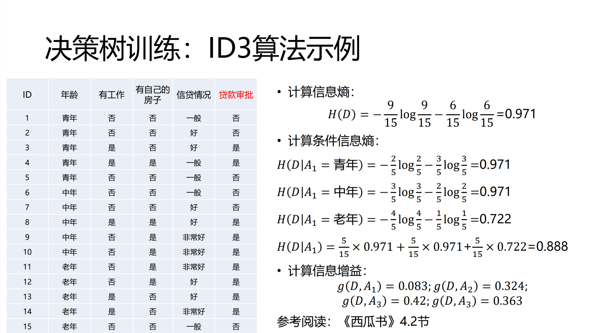

```{r setup, include=FALSE}
knitr::opts_chunk$set(echo = TRUE)
```

## Speed Dating——非诚勿扰

案例背景：近年来相亲电视节目层出不穷，婚恋市场异常火爆。据统计婚恋交友市场在2016年收入近百亿收入。每个单身狗怎么才能获得异性的芳心？婚恋网站如何才能在最短的时间内帮助有婚恋需求的人找到自己心仪的对象？或许数据科学的思维可以帮我们找到这些问题的答案。

案例数据提供了芝加哥商学院相亲实验数据。该数据是芝加哥商学院Ray Fisman教授和Sheena Iyengar 教授2002年至2004年组织的相亲实验数据。实验的开始，组织者在该校网站上招募相亲者。志愿者需要在网站上注册，经审核后方可参与相亲活动。注册时需要留下个人信息，包括性别、年龄、种族、从事领域和兴趣。而由于数据集变量众多，请先查看assignment7文件夹中的Speed Dating Data Key.doc文件和原始数据链接，了解数据变量。参考案例推文为什么影响因素决定“非诚勿扰”。

这个案例的学习目标包括：

1. 了解数据的基本处理方法；
2. 学会对数据进行统计分析，并且适当解读。
3. 学会根据数据案例，应用决策树和随机森林的方法构建模型，并对模型结果进行解读

### 准备工作

清除工作环境，安装和加载一些需要的包。

```{r, message=FALSE, warning=FALSE}
cat("\014"); rm(list=ls())  # 清除工作环境
library(data.table)
library(ggplot2)
library(nnet)
library(plyr)
library(ggpubr)
library(rpart)
library(rattle)
library(rpart.plot)
```

### 任务一

找到数据data，读入样本数据，命名为raw.data;

```{r}
raw.data <- fread("Speed Dating Data.csv", encoding = "UTF-8")
```


### 任务二

统计参与此次调查的男性与女性的人数，并绘制条形图；根据数据集中的gender列，0代表女生，1代表男生，最后作图也以女生和男生为类别。

```{r}
gender <- unique(raw.data[, c(1, 3)])  # 按iid提取出iid和gender
gender <- ddply(gender, .(gender), summarize, cnt = length(gender))  # 对gender计数
gender$gender <- c("女", "男")  # 将gender的0,1换成女,男
gender$gender <- factor(gender$gender, levels = c("女","男"))
p1 <- ggplot(gender, aes(x = gender, y = cnt, fill = gender)) +
  geom_bar(stat = "identity", width = 0.7) +
  labs(x = "性别", y = "人数") +
  geom_text(aes(label = cnt), vjust = -0.2) +
  scale_fill_manual(name = "性别", values = c("darkorange", "dodgerblue4")) +
  scale_x_discrete(limits = c("女", "男"))
p1
```


### 任务三

统计参与此次调查的人群分性别、不同种族的人数，并绘制条形图；

为什么需要了解被调查人群的男女比例和种族分布呢？说说你的理解；数据集race代表种族，1-6分别代表：非裔，欧洲裔，拉丁裔，亚裔，北美土著，其他。

```{r}
race <- unique(raw.data[, c(1, 3, 40)])  # 按iid提取出iid、gender和race
race <- ddply(race, .(race, gender), summarize, cnt = length(race))  # 对race计数 
race <- na.omit(race)  # 去除NA项
race$gender <- factor(race$gender, levels = c(0, 1), labels = c("女", "男"))  # 将gender的0,1换成女,男
race$race <- factor(race$race, levels = 1:6, labels = c("非裔", "欧洲裔", "拉丁裔", "亚裔", "北美土著", "其他"))  # 将race的1~6换成对应的实际种族
p2 <- ggplot(race, aes(x = race, y = cnt, fill = gender)) +
  geom_bar(stat = "identity", position = "dodge") +
  labs(x = "种族", y = "人数") +
  geom_text(aes(label = cnt), vjust = -0.2, position = position_dodge(0.9)) +
  scale_fill_manual(name = "性别", values = c("darkorange", "dodgerblue4")) +
  scale_x_discrete(limits = c("亚裔", "其他", "非裔", "欧洲裔", "拉丁裔"))
p2
```


### 任务四

首先选择数据集中wave小于6或者wave大于9的数据，然后查看相亲者对不同兴趣的偏好程度并绘制成柱状图，观察图像，尝试解读柱状图呈现的现象。（图中均值指每个兴趣爱好各自分数的均值，每个兴趣的分数对应数据中sports列到yoga列共17个列，最后利用ggplot作图。）

提示：在相亲中最受欢迎的兴趣是什么？最不受欢迎的兴趣又是什么呢？

```{r}
hobby <- raw.data[raw.data$wave > 6 & raw.data$wave < 9, ]  # 选择数据集中wave小于6或者wave大于9的数据
hobby <- unique(hobby[, c(1, 51:67)])  # 按iid提取出iid和每个兴趣爱好
hobby <- na.omit(hobby)  # 去除NA项
names <- colnames(hobby[, 2:18])  # 提取兴趣col的name
means <- as.vector(colMeans(hobby[, 2:18]))  # 提取兴趣col的mean
average <- data.frame(hobby = names, mean = means)  # 组成dataframe
average$hobby = factor(average$hobby, levels = c("gaming", "museums", "music", "hiking", "theater", "yoga", "movies", "tvsports", "tv", "art", "shopping", "sports", "dining", "clubbing", "exercise", "reading", "concerts"), labels = c("博彩", "博物馆", "听音乐", "徒步旅行", "戏剧", "瑜伽", "电影", "电视运动节目", "看电视", "艺术", "购物", "运动", "进餐", "逛夜店", "锻炼", "阅读", "音乐会"))  # 将average的英文hobby换成对应的中文兴趣
p3 <- ggplot(average, aes(x = hobby, y = mean)) +
  geom_bar(fill = "darkred", stat = "identity") +
  labs(x = "兴趣", y = "均值") +
  scale_x_discrete(limits = c("博彩", "博物馆", "听音乐", "徒步旅行", "戏剧", "瑜伽", "电影", "电视运动节目", "看电视", "艺术", "购物", "运动", "进餐", "逛夜店", "锻炼", "阅读", "音乐会")) +
  theme(axis.text.x = element_text(angle = 90, vjust = 0.5, hjust = 1))
p3
```


### 任务五

用箱线图分别查看 是否进一步交往这一决策 和 相亲者在不同方面得分 （吸引力，真诚，智商，幽默，有抱负，共同爱好）的关系，观察这些箱线图，你可以得出哪些结论？利用ggplot，x选择dec列，y选择attr，sinc，intel，fun，amb，shar这些列分别作图。

提示：哪些方面会显著影响相亲者们进一步交往的意愿呢？

```{r, warning=FALSE}
character <- raw.data[, 24:30]  # 提取决策，特征列
character$dec_o <- factor(character$dec_o)

## 绘制吸引力对相亲决策的影响
p41 <- ggplot(character, aes(x=dec_o, y=attr_o)) + 
  geom_boxplot(fill = "dodgerblue4", colour = "white", outlier.color = "white", outlier.size = 2) +
  labs(title = "吸引力对相亲决策的影响", x = "决策：是否接收相亲对象", y = "对方的吸引力得分") +
  theme(axis.title = element_text(size=7), plot.title = element_text(size=8, hjust = 0))

## 绘制真诚对相亲决策的影响
p42 <- ggplot(character, aes(x=dec_o, y=sinc_o)) + 
  geom_boxplot(fill = "dodgerblue4", colour = "white", outlier.color = "white", outlier.size = 2) +
  labs(title = "真诚对相亲决策的影响", x = "决策：是否接收相亲对象", y = "对方的真诚得分") +
  theme(axis.title = element_text(size=7), plot.title = element_text(size=8, hjust = 0))

## 绘制智商对相亲决策的影响
p43 <- ggplot(character, aes(x=dec_o, y=intel_o)) + 
  geom_boxplot(fill = "dodgerblue4", colour = "white", outlier.color = "white", outlier.size = 2) +
  labs(title = "智商对相亲决策的影响", x = "决策：是否接收相亲对象", y = "对方的智商得分") +
  theme(axis.title = element_text(size=7), plot.title = element_text(size=8, hjust = 0))

## 绘制幽默对相亲决策的影响
p44 <- ggplot(character, aes(x=dec_o, y=fun_o)) + 
  geom_boxplot(fill = "dodgerblue4", colour = "white", outlier.color = "white", outlier.size = 2) +
  labs(title = "幽默对相亲决策的影响", x = "决策：是否接收相亲对象", y = "对方的幽默得分") +
  theme(axis.title = element_text(size=7), plot.title = element_text(size=8, hjust = 0))

## 绘制有抱负对相亲决策的影响
p45 <- ggplot(character, aes(x=dec_o, y=amb_o)) + 
  geom_boxplot(fill = "dodgerblue4", colour = "white", outlier.color = "white", outlier.size = 2) +
  labs(title = "有抱负对相亲决策的影响", x = "决策：是否接收相亲对象", y = "对方的抱负得分") +
  theme(axis.title = element_text(size=7), plot.title = element_text(size=8, hjust = 0))

## 绘制共同爱好对相亲决策的影响
p46 <- ggplot(character, aes(x=dec_o, y=shar_o)) + 
  geom_boxplot(fill = "dodgerblue4", colour = "white", outlier.color = "white", outlier.size = 2) +
  labs(title = "共同爱好对相亲决策的影响", x = "决策：是否接收相亲对象", y = "对方的共同爱好得分") +
  theme(axis.title = element_text(size=7), plot.title = element_text(size=8, hjust = 0))

ggarrange(p41, p42, p43, p44, p45, p46, ncol = 3, nrow = 2)
```


### 任务六

经过之前的任务，你已经对相亲成功的影响因素有了一些基本的了解。现在，尝试用分类决策树的方法来分析相亲中主观指标上的得分对相亲结果的影响吧。

同样的，先准备建模分析需要的数据框；将女性和男性分别存储到名为female和male的数据框中，并用summary进行展示。

提示：主观指标为“吸引力”,“真诚”,“智力”,“幽默”,“雄心”,“共同爱好”。同时，考虑性别差异的存在，需要对男性和女性分开建模。

```{r}
model <- raw.data[, c(3,24:30)]  # 提取性别，决策，特征列
## 修改各指标名称确保与输出相符
model$dec_o <- factor(model$dec_o, levels = c(0, 1), labels = c("拒绝", "接受"))  # 将dec_o的0,1换成拒绝和接受
colnames(model) <- c("性别", "决定", "吸引力", "真诚", "智力", "幽默", "雄心", "共同爱好")  # 修改列明
## 对女性建模
female.model <- model[model$"性别" == 1, c(2:8)]
"Summary of Female"
summary(female.model)
## 对男性建模
male.model <- model[model$"性别" == 0, c(2:8)]
"Summary of Male"
summary(male.model)
```


### 任务七

利用rpart函数(参数method选择为’class’)对女性和男性（即female和male的数据集）分别建立决策树模型，并绘制得到的决策树；

仔细对比，尝试解读模型结果和得到的结论；

提示：可以用par(mfrow=c(1,2))将图像并列放置。

```{r}
## 对女性和男性建立决策树模型
female.tree <- rpart(决定~.,data = female.model, method = "class")
male.tree <- rpart(决定~., data = male.model, method = "class")
## 绘制得到的决策树
par(mfrow=c(1,2))
rpart.plot(female.tree, main = "女性的决策")
rpart.plot(male.tree, main = "男性的决策")
## 绘制更好看的决策树
par(mfrow=c(1,2))
fancyRpartPlot(female.tree, main = "女性的决策")
fancyRpartPlot(male.tree, main = "男性的决策") 
```


## 计算题


计算除年龄列外，其他列的信息增益。

解：对于$A_2$（有工作）分为是、否。
$$
H(D|A_2=是)=-\frac{5}{5}\log\frac{5}{5}=0 \\
H(D|A_2=否)=-\frac{4}{10}\log\frac{4}{10}-\frac{6}{10}\log\frac{6}{10}=0.971\\
H(D|A_2)=\frac{10}{15}\times 0.971=0.647\\
g(D,A_2)=0.971-0.647=0.324
$$
对于$A_3$（有自己的房子）分为是、否。
$$
H(D|A_3=是)=-\frac{6}{6}\log\frac{6}{6}=0 \\
H(D|A_3=否)=-\frac{3}{9}\log\frac{3}{9}-\frac{6}{9}\log\frac{6}{9}=0.918\\
H(D|A_3)=\frac{9}{15}\times 0.918=0.551\\
g(D,A_3)=0.971-0.551=0.420
$$
对于$A_4$（有自己的房子）分为一般、好、非常好。
$$
H(D|A_4=一般)=-\frac{1}{5}\log\frac{1}{5}-\frac{4}{5}\log\frac{4}{5}=0.722 \\
H(D|A_4=好)=-\frac{4}{6}\log\frac{4}{6}-\frac{2}{6}\log\frac{2}{6}=0.918\\
H(D|A_4=非常好)=-\frac{4}{4}\log\frac{4}{4}=0\\
H(D|A_4)=\frac{5}{15}\times 0.722+\frac{6}{15}\times 0.918=0.608\\
g(D,A_4)=0.971-0.608=0.363
$$
综上，
$$
g(D,A_2)=0.324\\
g(D,A_3)=0.420\\
g(D,A_4)=0.363
$$